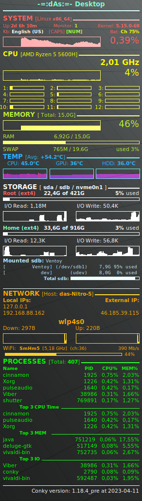
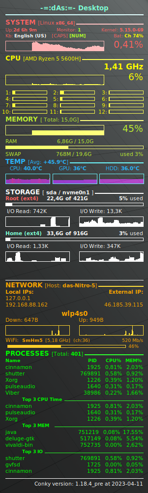
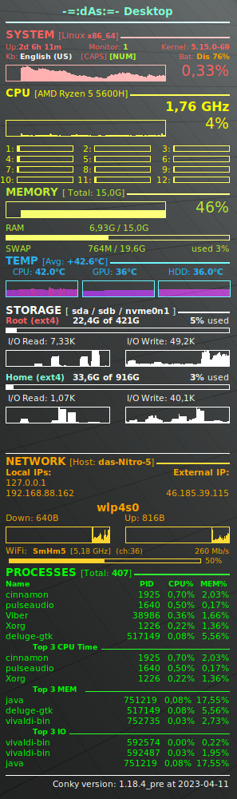

  

[Official Conky GitHub Repository](https://github.com/brndnmtthws/conky/) | [Official Docs: Variables](https://conky.cc/variables) | [Official Docs: Configuration settings](https://conky.cc/config_settings)
## Conky Configuration by -=:dAs:=
### 📃 Features
- color-separate blocks view
- compact and brief view of main system parameters
- battery colored status (**Ch** => Charging, **Dis** => Discharging, **Full**)
- overall **CPU** usage and frequency and separate Cores usage
- total **RAM** and **SWAP** usage
- temperature of **CPU, GPU, HDD** with **gradient** graph - ❗ it works fine with **1.18.1_pre version**, old versions may not show gradient
- storage usage, **I/O read/write**, upto 2 mounted disks shows
- network statistics for **Wired** and/or **Wireless** with Down/Up info and current **Wi-Fi** info
- overall **Top** processes and separate using **CPU/MEM/IO**
### 🖼 Screenshots
  
### 🚀 Quick start
Just copy `conky.conf` and `get_bat.sh` files into `~/.conf/conky/` directory or run conky with command `conky -d -c <path_to_conky.conf_file>` (in those case make sure you made changes into `concy.conf` for `get_bat.sh` location, use absolute path)

#### 👉 Make sure you made changes in conky.conf file according to you system configuration:
- change buttery number (if necessary)
- change CPU cores to you own
- correct Temperature section to your system config; **it may need you to add** `drivetemp` module into `/etc/modules-load.d/drivetemp.conf` with `echo drivetemp | sudo tee /etc/modules-load.d/drivetemp.conf`
- correct Storage section with your system drive names (like /dev/sda or /dev/nvme0n1); change names of removable drives
- change names of Network interfaces
- you may need to change update interval, set by default to 3 sec; it stored in `update_interval` variable
- for multiple monitors (aka [Xinerama](https://en.wikipedia.org/wiki/Xinerama) or [Multihead](https://wiki.archlinux.org/title/multihead)) change the `xinerama_head` parameter from 0 (default) to 1,2,3,...

📕 💬 See [Compile Conky from sources](files/compile.md) if you want to take last version with features you need.

###### _Made by -=:dAs:=-_